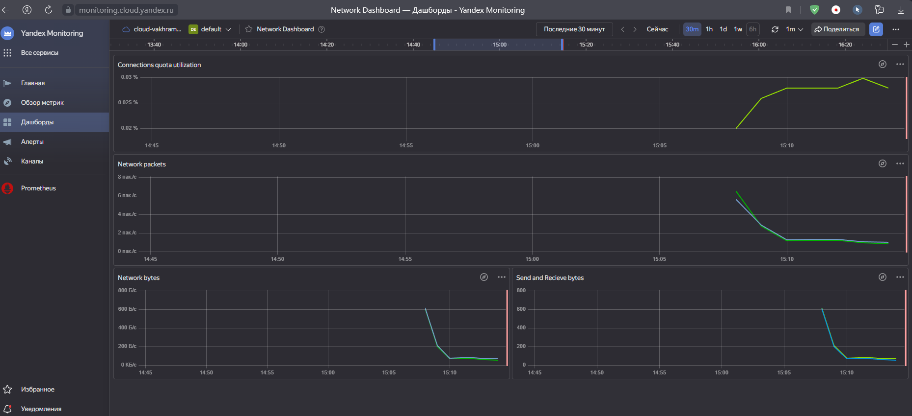
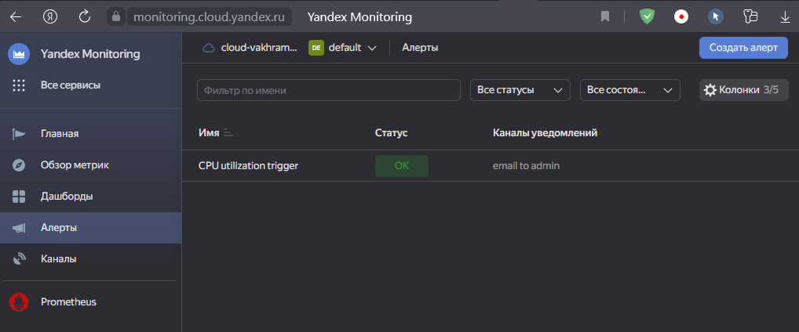
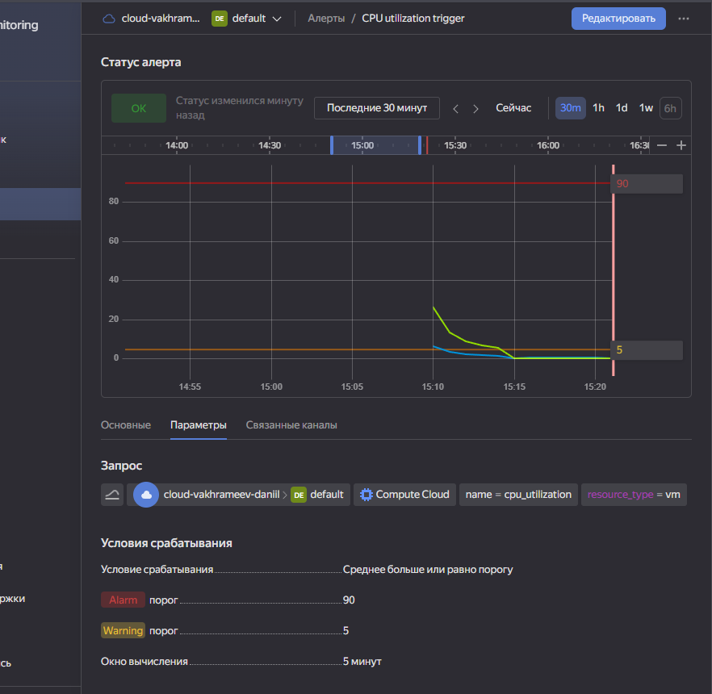
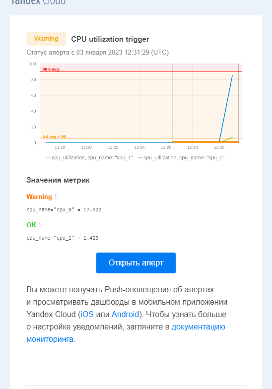

# 9.1-Monitoring-System

---
## 1. Какие преимущества и недостатки реактивного и проактивного мониторинга?

### Реактивный мониторинг.  
> Преимущества:
> 1. Позволяет реагировать на большинство видов угроз. При минимуме затрат.
> 2. Быстрое разворачивание.

> Недостатки:  
> 1. Не возможность прогнозирования проблем.
> 2. Трудность комплексного решения проблем.

### Проактивный мониторинг.  
> Преимущества:  
> 1. Позволяет своевременно прогнозировать и исправлять возникающие проблемы.  

> Недостатки:
> 1. Более высокие требования к системе мониторинга для коореляции и прогнозирования событий.
> 2. Сложность построения правил кореляций событий для прогнозирования. Возможность чего-то не учесть.

## 2. Какие метрики необходимо мониторить у веб-страницы, чтобы знать о ее доступности и функциональности? 

> 1. HTTP status code  
> 2. ping 
> 3. службы Apache, nginx
> 4. лог файлов

## 3. С помощью Yandex Monitoring создайте дашборд, на котором видны основные метрики сетевого подключения вашей виртуальной машины.

> 

## 4. С помощью Yandex Monitoring сделайте 2 алерта на загрузку процессора: WARN и ALARM. И создайте уведомление по e-mail.
> 
> 
> 

f
